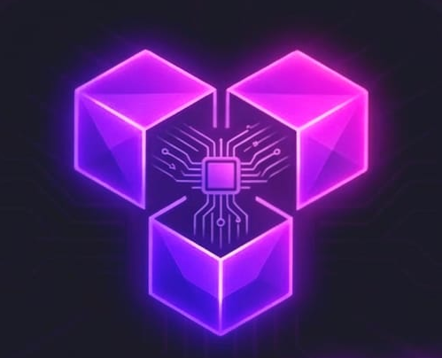

<p align="center">
  
</p>

<h1 align="center">TeamOS</h1>

<p align="center">
  A real-time team messaging platform — channels, direct messages, video calls, polls, reactions, location sharing, and more.
</p>

---

## Overview

TeamOS is a full-stack real-time messaging application built for modern teams. It combines channel-based communication with rich messaging features including polls, location sharing, file uploads, emoji reactions, and video calls — all in a responsive, mobile-first interface that works like WhatsApp on mobile and like a desktop workspace on larger screens.

---

## Features

### Messaging
- Real-time messaging via Stream Chat WebSocket — channels and direct messages
- WhatsApp-style quoted replies with scroll-to-original
- Emoji reactions with live counts
- Pin/unpin messages — server-side via Stream admin API
- Pinned message banner that cycles through all pinned messages and scrolls to each
- Typing indicators and online presence

### Rich Content
- Polls — single and multi-select, real-time vote counts, voter names visible to creator
- Location sharing — current GPS location with OpenStreetMap preview card
- File and image sharing — upload to Stream CDN with inline preview
- Camera capture — direct mobile camera upload
- Emoji picker — searchable, 200+ emojis, inserts at cursor position

### Channels
- Public and private channels
- Public channel search by name or ID — join in one tap
- Invite members to private channels
- Channel detail panel — member list, pinned messages, member count
- Owner controls — remove members, ban members (banned users keep history but lose access)
- Delete channel (owner only) or leave channel (members)

### Video Calls
- Start and join video calls via Stream Video SDK
- Incoming call popup with ring animation and accept/decline
- Live call banner when a call is active in the current channel
- Per-channel call history with duration and status (ended/missed)
- Call cards rendered inline in the message list

### Friends & People
- Friend system — send, accept, reject, and remove friend requests
- People tab — search all users and send friend requests
- Friend profile panel — view shared channels, pinned messages, message/call stats
- Online presence — live green/gray dot on DM contacts
- Unread badges — red count badges on channels and DMs

### Mobile
- Full WhatsApp-style two-view navigation on mobile
- List view (contacts/channels) slides to chat view on selection
- Back arrow in chat header returns to list — no overlay, no hamburger
- Responsive layout — full desktop sidebar on screens ≥ 900px

### Account
- Profile page — update display name, avatar, and password
- Clerk-powered authentication with re-verification for sensitive actions
- Sentry error tracking on both frontend and backend

---

## Tech Stack

| Layer | Technology | Version |
|-------|-----------|---------|
| Frontend framework | React | 19 |
| Build tool | Vite | 7 |
| Styling | Tailwind CSS | 4 |
| Authentication | Clerk | 5 |
| Chat SDK | Stream Chat (stream-chat-react) | 13 |
| Video SDK | Stream Video React SDK | 1 |
| Server state | TanStack React Query | 5 |
| HTTP client | Axios | 1 |
| Icons | Lucide React | — |
| Notifications | React Hot Toast | — |
| Routing | React Router | 7 |
| Error tracking (FE) | Sentry React | 10 |
| Backend runtime | Node.js + Express | v5 |
| Database | MongoDB (Mongoose) | 8 |
| Auth middleware | Clerk Express | — |
| Background jobs | Inngest | 3 |
| Error tracking (BE) | Sentry Node | 10 |

---

## Project Structure

```
TeamOS/
├── frontend/
│   ├── public/
│   │   ├── logo-2.png                    # TeamOS logo
│   │   └── auth-i.png                    # Auth page illustration
│   └── src/
│       ├── components/
│       │   ├── AttachmentModal.jsx        # + button sheet (gallery/camera/location/doc/poll)
│       │   ├── CallHistoryPanel.jsx       # Per-channel call history
│       │   ├── CallMessage.jsx            # Call card rendered in chat
│       │   ├── ChannelDetailModal.jsx     # Channel info, members, owner controls
│       │   ├── ChannelSettingsModal.jsx   # Channel settings view
│       │   ├── ChannelsPanel.jsx          # Sidebar channels list with skeletons
│       │   ├── ChatInputWrapper.jsx       # Message input with emoji/attachments/reply
│       │   ├── CreateChannelModal.jsx     # Create public/private channel
│       │   ├── CustomChannelHeader.jsx    # Header with back arrow, call, pin, invite
│       │   ├── CustomChannelPreview.jsx   # Sidebar channel list item
│       │   ├── EmojiPicker.jsx            # Searchable emoji picker
│       │   ├── FriendProfileModal.jsx     # Friend profile with stats and shared channels
│       │   ├── FriendsList.jsx            # DM contacts list with presence
│       │   ├── IncomingCallManager.jsx    # Manages incoming call popup state
│       │   ├── IncomingCallPopup.jsx      # Ring animation popup
│       │   ├── InviteModal.jsx            # Invite users to private channel
│       │   ├── LiveCallBanner.jsx         # Live call in progress banner
│       │   ├── LocationMessage.jsx        # GPS location map card
│       │   ├── MembersModal.jsx           # Channel members list
│       │   ├── PageLoader.jsx             # Full-screen loading state
│       │   ├── PeoplePanel.jsx            # User search and friend requests
│       │   ├── PinnedMessageBanner.jsx    # Cycling pinned message banner
│       │   ├── PinnedMessagesModal.jsx    # All pinned messages list
│       │   ├── PollMessage.jsx            # Poll card with real-time voting
│       │   ├── ProfileModal.jsx           # User profile modal
│       │   ├── PublicChannelJoin.jsx      # Search and join public channels
│       │   ├── PublicChannelPreview.jsx   # Public channel search result
│       │   ├── ReactionDisplay.jsx        # Emoji reaction row
│       │   ├── ReplyBox.jsx               # Reply preview component
│       │   └── UsersList.jsx              # Users list with presence
│       ├── hooks/
│       │   └── useStreamChat.js           # Stream Chat singleton connection hook
│       ├── lib/
│       │   ├── api.js                     # All Axios API call functions
│       │   ├── axios.js                   # Axios instance with Clerk auth headers
│       │   └── callMessages.js            # Call message parsing and localStorage utils
│       ├── pages/
│       │   ├── AuthPage.jsx               # Sign in / sign up landing page
│       │   ├── CallPage.jsx               # Video call room
│       │   ├── HomePage.jsx               # Main chat layout (WhatsApp-style mobile nav)
│       │   ├── ProfilePage.jsx            # Account settings — name, avatar, password
│       │   └── PublicChannelPage.jsx      # Public channel shareable preview
│       ├── providers/
│       │   └── AuthProvider.jsx           # Clerk auth wrapper
│       └── styles/                        # CSS theme files and layout overrides
│
└── backend/
    └── src/
        ├── config/
        │   ├── db.js                      # MongoDB connection
        │   ├── env.js                     # Environment variable loader
        │   ├── inngest.js                 # Background jobs — user sync on Clerk events
        │   └── stream.js                  # Stream Chat server-side client
        ├── controllers/
        │   ├── chat.controller.js         # All chat logic — token, channels, messages, calls
        │   └── friend.controller.js       # Friend requests and user search
        ├── middleware/
        │   └── auth.middleware.js         # Clerk JWT verification
        ├── models/
        │   ├── friend.model.js            # FriendRequest schema (sender, receiver, status)
        │   └── user.model.js              # User schema (clerkId, email, name, image)
        └── routes/
            ├── chat.route.js              # Chat API routes
            └── friend.route.js            # Friend API routes
```

---

## API Reference

### Chat

| Method | Endpoint | Description |
|--------|----------|-------------|
| GET | `/api/chat/token` | Get Stream Chat user token |
| GET | `/api/chat/channels/public/:channelId` | Search public channel by name or ID |
| POST | `/api/chat/channels/:channelId/join` | Join a public channel |
| POST | `/api/chat/channels/:channelId/invite` | Invite users to a private channel |
| DELETE | `/api/chat/channels/:channelId/members/:memberId` | Remove a member (owner only) |
| POST | `/api/chat/channels/:channelId/members/:memberId/ban` | Ban a member (owner only) |
| DELETE | `/api/chat/channels/:channelId/members/:memberId/ban` | Unban a member (owner only) |
| POST | `/api/chat/messages/:messageId/pin` | Pin a message |
| POST | `/api/chat/messages/:messageId/unpin` | Unpin a message |
| POST | `/api/chat/messages/:messageId/vote` | Vote on a poll |
| GET | `/api/chat/channels/:channelId/call-history` | Get call history for a channel |

### Friends

| Method | Endpoint | Description |
|--------|----------|-------------|
| GET | `/api/friends` | List accepted friends |
| GET | `/api/friends/requests` | Get pending incoming friend requests |
| GET | `/api/friends/sent` | Get sent friend requests |
| GET | `/api/friends/search` | Search users by name or email |
| POST | `/api/friends/request/:targetUserId` | Send a friend request |
| POST | `/api/friends/accept/:requestId` | Accept a friend request |
| POST | `/api/friends/reject/:requestId` | Reject a friend request |
| DELETE | `/api/friends/:friendId` | Remove a friend |

---

## Background Jobs (Inngest)

Inngest handles Clerk webhook events automatically:

| Function | Trigger | Action |
|----------|---------|--------|
| `sync-user` | `clerk/user.created` | Creates user in MongoDB and upserts to Stream |
| `delete-user-from-db` | `clerk/user.deleted` | Removes user from MongoDB and Stream |

---

## Environment Variables

### Frontend (`frontend/.env`)

```env
VITE_CLERK_PUBLISHABLE_KEY=
VITE_STREAM_API_KEY=
VITE_SENTRY_DSN=
VITE_API_BASE_URL=http://localhost:5001/api
```

### Backend (`backend/.env`)

```env
PORT=5001
MONGO_URI=
NODE_ENV=development
CLIENT_URL=http://localhost:5173
CLERK_PUBLISHABLE_KEY=
CLERK_SECRET_KEY=
STREAM_API_KEY=
STREAM_API_SECRET=
SENTRY_DSN=
INNGEST_EVENT_KEY=
INNGEST_SIGNING_KEY=
```

---

## Getting Started

```bash
# 1. Clone and install
cd backend && npm install
cd ../frontend && npm install

# 2. Configure environment variables
cp backend/.env.example backend/.env
cp frontend/.env.example frontend/.env
# Fill in your keys in both .env files

# 3. Start the backend (port 5001)
cd backend && npm run dev

# 4. Start the frontend in a separate terminal (port 5173)
cd frontend && npm run dev
```

Open [http://localhost:5173](http://localhost:5173) in your browser.

---

## Deployment

Both `frontend/` and `backend/` include `vercel.json` for Vercel deployment.

- Frontend: deploy as a Vite static site — set all `VITE_*` env vars in Vercel project settings
- Backend: deploy as a serverless Node.js app — set all backend env vars in Vercel project settings
- Make sure `CLIENT_URL` in the backend points to your deployed frontend URL

---

## UI Design Reference

See [`UI-DESIGN-BRIEF.md`](./UI-DESIGN-BRIEF.md) for the complete visual and functional specification — layout diagrams, color tokens, typography, animation inventory, and full component breakdowns.
