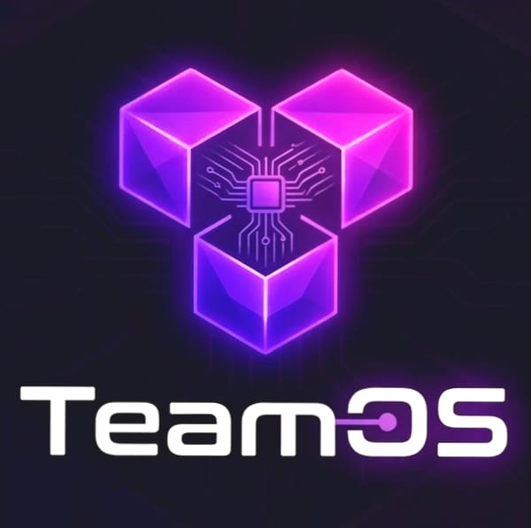

<div align="center">
  
  <h1>TeamOS</h1>
  <p>A real-time team communication platform — channels, DMs, voice calls, polls, and more.</p>

  
  
  
  
  
</div>

---

## What is TeamOS?

TeamOS is a full-stack Slack-style communication app. It supports real-time messaging, voice/video calls, friend requests, public and private channels, polls, file sharing, location sharing, message pinning, reactions, and more — all wrapped in a clean dark UI.

---

## Tech Stack

### Frontend
| Tech | Purpose |
|------|---------|
| React 19 + Vite | UI framework and build tool |
| Stream Chat React SDK | Real-time chat UI components and state |
| Clerk (`@clerk/clerk-react`) | Authentication — sign in, sign up, user sessions |
| React Router v7 | Client-side routing |
| TanStack Query | Server state management and API caching |
| Sentry (`@sentry/react`) | Frontend error tracking and performance monitoring |
| Vercel Analytics | Page view and event analytics |
| React Hot Toast | Toast notifications |
| Lucide React | Icon library |

### Backend
| Tech | Purpose |
|------|---------|
| Node.js + Express | REST API server |
| MongoDB + Mongoose | Database for users and friend relationships |
| Clerk (`@clerk/express`) | JWT verification middleware — protects all routes |
| Stream Chat Node SDK | Server-side channel management, token generation, message ops |
| Inngest | Event-driven background jobs (user sync on signup/delete) |
| Sentry (`@sentry/node`) | Backend error tracking |

---

## Features

- Real-time messaging with threads, replies, and reactions
- Voice and video calls with live call banners and call history
- Public channels (discoverable and joinable) and private channels (invite-only)
- Direct messages between friends
- Friend system — send, accept, reject, and remove friends
- Message pinning (server-side via Stream admin client)
- Polls with single and multi-select voting
- File and image attachments
- Location sharing (static and live)
- Channel management — member roles, remove/ban/unban members
- Unread badge counts per tab (DMs, Channels, People)
- Mobile-responsive layout with WhatsApp-style navigation
- Automatic user sync to Stream and MongoDB on Clerk signup/delete via Inngest webhooks

---

## Environment Variables

### Backend — `backend/.env`

```env
PORT=5001
MONGO_URI=your_mongo_uri_here
NODE_ENV=development

CLERK_PUBLISHABLE_KEY=your_clerk_publishable_key_here
CLERK_SECRET_KEY=your_clerk_secret_key_here

STREAM_API_KEY=your_stream_api_key_here
STREAM_API_SECRET=your_stream_api_secret_here

SENTRY_DSN=your_sentry_dsn_here

INNGEST_EVENT_KEY=your_inngest_event_key_here
INNGEST_SIGNING_KEY=your_inngest_signing_key_here

CLIENT_URL=http://localhost:5173
```

### Frontend — `frontend/.env`

```env
VITE_CLERK_PUBLISHABLE_KEY=your_clerk_publishable_key_here
VITE_STREAM_API_KEY=your_stream_api_key_here
VITE_SENTRY_DSN=your_sentry_dsn_here
VITE_API_BASE_URL=http://localhost:5001/api
```

### What each key does

| Variable | Where | Purpose |
|----------|-------|---------|
| `CLERK_PUBLISHABLE_KEY` | Both | Identifies your Clerk app — used in frontend to initialize ClerkProvider and in backend to verify JWTs |
| `CLERK_SECRET_KEY` | Backend only | Server-side Clerk SDK — used to fetch user data from Clerk API (e.g. name, avatar) and protect routes via `clerkMiddleware()` |
| `STREAM_API_KEY` | Both | Identifies your Stream app — frontend uses it to connect the chat client |
| `STREAM_API_SECRET` | Backend only | Signs Stream user tokens and performs admin operations (pin messages, ban users, create channels) |
| `SENTRY_DSN` | Both | Tells Sentry where to send error reports — frontend tracks React errors, backend tracks Express errors |
| `INNGEST_EVENT_KEY` | Backend only | Authenticates events sent to Inngest — used when triggering background functions |
| `INNGEST_SIGNING_KEY` | Backend only | Verifies that incoming Inngest webhook calls are legitimate and not spoofed |
| `MONGO_URI` | Backend only | MongoDB connection string — stores users and friend request records |
| `CLIENT_URL` | Backend only | Allowed CORS origin — set to your frontend URL in production |

---

## Getting Started

### Prerequisites
- Node.js 18+
- MongoDB database (local or Atlas)
- Accounts on: [Clerk](https://clerk.com), [Stream](https://getstream.io), [Inngest](https://inngest.com), [Sentry](https://sentry.io)

### Install & Run

```bash
# Backend
cd backend
npm install
npm run dev

# Frontend (separate terminal)
cd frontend
npm install
npm run dev
```

### Inngest Setup

Inngest handles two background jobs automatically:
- `clerk/user.created` — creates the user in MongoDB and syncs them to Stream
- `clerk/user.deleted` — removes the user from MongoDB and Stream

In development, run the Inngest dev server:

```bash
npx inngest-cli@latest dev
```

Then configure your Clerk webhook to point to `http://localhost:5001/api/inngest`.

---

## Project Structure

```
TeamOS/
├── backend/
│   ├── src/
│   │   ├── config/       # DB, Stream, Inngest, env config
│   │   ├── controllers/  # chat and friend logic
│   │   ├── middleware/   # Clerk auth middleware
│   │   ├── models/       # User and FriendRequest schemas
│   │   └── routes/       # API route definitions
│   └── instrument.mjs    # Sentry backend init
└── frontend/
    └── src/
        ├── components/   # All UI components
        ├── hooks/        # useStreamChat
        ├── lib/          # API helpers, axios instance
        ├── pages/        # HomePage, AuthPage, CallPage, etc.
        ├── providers/    # AuthProvider
        └── styles/       # CSS modules and theme files
```

---

## Deployment

Both frontend and backend include `vercel.json` for Vercel deployment.

- Frontend: deploy the `frontend/` folder as a Vite project
- Backend: deploy the `backend/` folder as a serverless Node.js app

Make sure to set all environment variables in your Vercel project settings.

---

<div align="center">
  Built with Stream, Clerk, Inngest, and a lot of purple.
</div>
